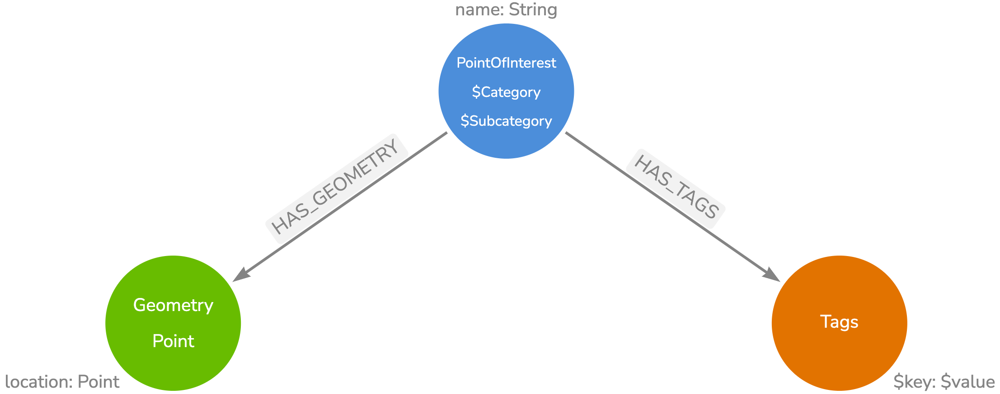

# Daylight Earth Graph

Working with the [Daylight Earth Table](https://daylightmap.org/earth/) OpenStreetMap distribution in Neo4j.

## Setup

This project uses Poetry to manage Python dependencies and virtual environments.

```
poetry init
poetry shell
jupyter notebook
```

## Points Of Interest



See POI_import.ipynb
